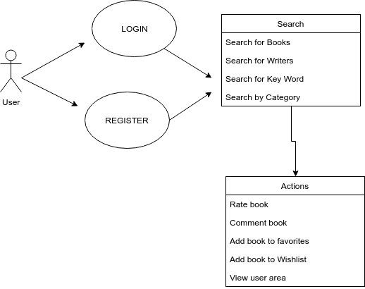
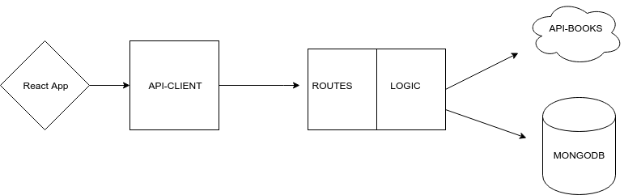

# Book Buddies

## Definition:

    Book Buddies is a book recommendation site. Users must create an account in order to access its content.

    Users can search for books by their titles, authors, ISBN, category or any keyword.

    This site is aimed at Spanish speakers and should return the book results in Spanish.

    Once the user has an account, they can rate any book, write a review, add the book to favorites or add them to the wishlist.

You can see the demo [here](http://book-buddies.surge.sh/#/)

## User Cases

## Data Model

## Block Model

## Calendar 

|    Date   |  Break Points  |
|------------|-----------------|
| 16/03/2018 | Read-only app deployed to surge. API client should be done. TDD of the API client It should list the main results in a React deployment| 
| 20/03/2018 | React part should be complete by now. Every API call should be done and listed. | 
| 2018-03-23 | App should be mostly done. I should be able to create lists, ratings, reviews, save them in MongoDb and list them with read when required| 
| 2018-03-28 | Improvements and bug testing| 
| 2018-03-30 | Relaxed day. Pizzas and beers before Demo day. | 

## Trello

[Enlace a Trello](https://trello.com/b/VuBC8YmB/book-buddies)

## What did I use?

-   Bulma CSS Framework
-   ReactJS
-   ES6
-   Node
-   Express
-   Google Books API
-   MongoDB
-   Mongoose
-   Git
-   GitHub
-   Mocha
-   Firebase
-   Slick Carousel
-   Sweetalert 2

## Heroku && surge

-   [surge](http://book-buddies.surge.sh/#/)
-   [heroku](https://aqueous-tundra-90892.herokuapp.com/)
-   [herokugit](https://git.heroku.com/aqueous-tundra-90892.git)